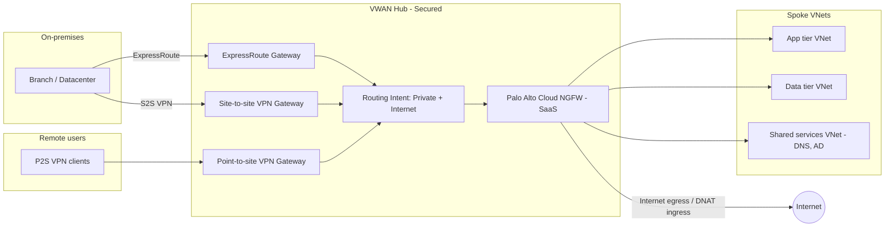

# Virtual WAN Review Checklist

Customer-architect review checklist for Azure Virtual WAN, organized by Well-Architected Framework pillars and Cloud
Adoption Framework topology guidance. See [`README.md`](README.md) for the status legend, risk/priority rubrics, and
evidence convention. Per-control deep-dives live in [`02-vwan-review-addendum.md`](02-vwan-review-addendum.md).

## Reference diagram (logical view — not a topology diagram)

The diagram below shows logical traffic intent in a Secured VWAN hub with Palo Alto Cloud NGFW. It deliberately omits
address spaces, availability-zone placement, gateway scale units, and physical paths. Use it as a conversation aid,
not as a deployment artifact.

## Executive summary

Reviewer fills this after walking the checklist. Suggested structure:

| Pillar               | Controls reviewed | Pass | Partial | Gap | N/A | Top risk callouts |
| -------------------- | ----------------- | ---- | ------- | --- | --- | ----------------- |
| Reliability          | `<TBD>`           |      |         |     |     | `<TBD>`           |
| Security             | `<TBD>`           |      |         |     |     | `<TBD>`           |
| Cost Optimization    | `<TBD>`           |      |         |     |     | `<TBD>`           |
| Operational Excel.   | `<TBD>`           |      |         |     |     | `<TBD>`           |
| Performance Eff.     | `<TBD>`           |      |         |     |     | `<TBD>`           |
| CAF topology         | `<TBD>`           |      |         |     |     | `<TBD>`           |
| Palo Alto Cloud NGFW | `<TBD>`           |      |         |     |     | `<TBD>`           |

Narrative summary (top three gaps, recommended sequencing, blockers): `<TBD>`.

## Reliability

| ID      | Control                                                                            | Why it matters                                              | Priority    | Risk if gap | Evidence (path) | Suggested check                                | Status | Reference                                              |
| ------- | ---------------------------------------------------------------------------------- | ----------------------------------------------------------- | ----------- | ----------- | --------------- | ---------------------------------------------- | ------ | ------------------------------------------------------ |
| REL-01  | VWAN Standard SKU (not Basic) for all production hubs                              | Basic lacks zone redundancy, advanced routing, hub-to-hub   | Required    | H           | `<TBD>`         | see A-REL-01                                   | `<TBD>`| [→ A-REL-01](02-vwan-review-addendum.md#a-rel-01)      |
| REL-02  | Multi-region hubs deployed (≥ 2 regions, ideally Azure paired regions)             | Survives region failure; preserves global transit           | Required    | H           | `<TBD>`         | see A-REL-02                                   | `<TBD>`| [→ A-REL-02](02-vwan-review-addendum.md#a-rel-02)      |
| REL-03  | Hub address space sized `/23` minimum, no overlap with spokes or on-prem CIDRs     | `/24` is the floor; routing infra needs growth headroom     | Required    | H           | `<TBD>`         | see A-REL-03                                   | `<TBD>`| [→ A-REL-03](02-vwan-review-addendum.md#a-rel-03)      |
| REL-04  | VPN Gateway deployed with zone-redundant SKU; AZ flag set at gateway create        | Tunnel survival during AZ failure                           | Required    | H           | `<TBD>`         | see A-REL-04                                   | `<TBD>`| [→ A-REL-04](02-vwan-review-addendum.md#a-rel-04)      |
| REL-05  | Site-to-site tunnels deployed active-active with BGP on both                       | No convergence delay on instance failover                   | Recommended | M           | `<TBD>`         | see A-REL-05                                   | `<TBD>`| [→ A-REL-05](02-vwan-review-addendum.md#a-rel-05)      |
| REL-06  | VPN deployed as backup behind ExpressRoute with BGP pref favoring ER               | Maintains hybrid connectivity on ER circuit loss            | Recommended | M           | `<TBD>`         | see A-REL-06                                   | `<TBD>`| [→ A-REL-06](02-vwan-review-addendum.md#a-rel-06)      |
| REL-07  | Routing infrastructure units sized above baseline; 25-min scale-up known           | Hub router scale is not instant — overprovision growth      | Required    | M           | `<TBD>`         | see A-REL-07                                   | `<TBD>`| [→ A-REL-07](02-vwan-review-addendum.md#a-rel-07)      |
| REL-08  | P2S VPN uses global VPN profile; address pool sized for 2× concurrent users        | Failover hub selection; pool exhaustion during redistribute | Recommended | M           | `<TBD>`         | see A-REL-08                                   | `<TBD>`| [→ A-REL-08](02-vwan-review-addendum.md#a-rel-08)      |
| REL-09  | FMA documented: region loss, ER loss, branch loss, hub-router scale, BGP flap      | Failover behaviour discovered in design, not in incident    | Required    | M           | `<TBD>`         | see A-REL-09                                   | `<TBD>`| [→ A-REL-09](02-vwan-review-addendum.md#a-rel-09)      |
| REL-10  | Composite SLA calculated end-to-end (hub + gateway + firewall)                     | 99.95 % hub-only is not the user-facing SLA                 | Recommended | L           | `<TBD>`         | see A-REL-10                                   | `<TBD>`| [→ A-REL-10](02-vwan-review-addendum.md#a-rel-10)      |
| REL-11  | DR test plan executed at least annually (region, ER, BGP failover scenarios)       | Untested DR = unknown DR                                    | Recommended | M           | `<TBD>`         | see A-REL-11                                   | `<TBD>`| [→ A-REL-11](02-vwan-review-addendum.md#a-rel-11)      |

## Security

| ID      | Control                                                                                      | Why it matters                                            | Priority    | Risk if gap | Evidence (path) | Suggested check        | Status | Reference                                                |
| ------- | -------------------------------------------------------------------------------------------- | --------------------------------------------------------- | ----------- | ----------- | --------------- | ---------------------- | ------ | -------------------------------------------------------- |
| SEC-01  | Azure security baseline for Virtual WAN applied (Defender for Cloud regulatory compliance)   | Foundational control coverage; auditable                  | Required    | M           | `<TBD>`         | see A-SEC-01           | `<TBD>`| [→ A-SEC-01](02-vwan-review-addendum.md#a-sec-01)        |
| SEC-02  | Secured virtual hub (Azure Firewall or partner SaaS) with routing intent for private+internet| Centralized inspection; default-deny intent               | Required    | H           | `<TBD>`         | see A-SEC-02           | `<TBD>`| [→ A-SEC-02](02-vwan-review-addendum.md#a-sec-02)        |
| SEC-03  | P2S VPN uses Microsoft Entra ID auth with Conditional Access and MFA                         | MFA, device compliance, risk-based access                 | Required    | H           | `<TBD>`         | see A-SEC-03           | `<TBD>`| [→ A-SEC-03](02-vwan-review-addendum.md#a-sec-03)        |
| SEC-04  | NSGs on all spoke subnets, default-deny inbound; complement hub firewall                     | Defense in depth; subnet-level filter                     | Required    | M           | `<TBD>`         | see A-SEC-04           | `<TBD>`| [→ A-SEC-04](02-vwan-review-addendum.md#a-sec-04)        |
| SEC-05  | Private endpoints for PaaS in spokes; no public exposure for SQL/Storage/Cosmos              | Eliminates data exfil to PaaS public endpoints            | Required    | H           | `<TBD>`         | see A-SEC-05           | `<TBD>`| [→ A-SEC-05](02-vwan-review-addendum.md#a-sec-05)        |
| SEC-06  | DDoS Network/IP Protection on spoke public IPs (hub PIPs not supported)                      | Volumetric attack mitigation at the edge                  | Recommended | M           | `<TBD>`         | see A-SEC-06           | `<TBD>`| [→ A-SEC-06](02-vwan-review-addendum.md#a-sec-06)        |
| SEC-07  | Custom IPsec policy uses AES-256-GCM + SHA-256/384; no DES/3DES/MD5                          | Strong crypto; no legacy cipher suites                    | Required    | H           | `<TBD>`         | see A-SEC-07           | `<TBD>`| [→ A-SEC-07](02-vwan-review-addendum.md#a-sec-07)        |
| SEC-08  | ExpressRoute encryption (MACsec or VPN-over-ER) for regulated workloads                      | ER private peering is unencrypted by default              | Recommended | M           | `<TBD>`         | see A-SEC-08           | `<TBD>`| [→ A-SEC-08](02-vwan-review-addendum.md#a-sec-08)        |
| SEC-09  | Hub-to-hub encryption considered (GA caveats and regional support reviewed)                  | Inter-hub traffic over MS backbone — encrypt if required  | Optional    | M           | `<TBD>`         | see A-SEC-09           | `<TBD>`| [→ A-SEC-09](02-vwan-review-addendum.md#a-sec-09)        |
| SEC-10  | RBAC: least-privilege; custom roles where Network Contributor is too broad                   | Limits blast radius of compromised identity               | Required    | M           | `<TBD>`         | see A-SEC-10           | `<TBD>`| [→ A-SEC-10](02-vwan-review-addendum.md#a-sec-10)        |
| SEC-11  | Forced tunneling for P2S internet egress (when required by policy)                           | Remote users subject to corporate inspection              | Optional    | M           | `<TBD>`         | see A-SEC-11           | `<TBD>`| [→ A-SEC-11](02-vwan-review-addendum.md#a-sec-11)        |
| SEC-12  | Key Vault stores VPN PSKs and certificates with rotation policy                              | Eliminates secrets-in-config drift                        | Required    | H           | `<TBD>`         | see A-SEC-12           | `<TBD>`| [→ A-SEC-12](02-vwan-review-addendum.md#a-sec-12)        |
| SEC-13  | Microsoft Sentinel onboarded with VWAN + Firewall data connectors                            | Proactive threat detection; SOC correlation               | Recommended | M           | `<TBD>`         | see A-SEC-13           | `<TBD>`| [→ A-SEC-13](02-vwan-review-addendum.md#a-sec-13)        |

## Cost Optimization

| ID      | Control                                                                                | Why it matters                                            | Priority    | Risk if gap | Evidence (path) | Suggested check       | Status | Reference                                              |
| ------- | -------------------------------------------------------------------------------------- | --------------------------------------------------------- | ----------- | ----------- | --------------- | --------------------- | ------ | ------------------------------------------------------ |
| COST-01 | Cost model built in Azure Pricing Calculator before deployment (fixed + variable)      | Avoid budget surprises from data-processing charges       | Required    | M           | `<TBD>`         | see A-COST-01         | `<TBD>`| [→ A-COST-01](02-vwan-review-addendum.md#a-cost-01)    |
| COST-02 | Tags applied to hubs, gateways, connections; Azure Policy enforces tag presence        | Chargeback/showback; cost attribution                     | Recommended | L           | `<TBD>`         | see A-COST-02         | `<TBD>`| [→ A-COST-02](02-vwan-review-addendum.md#a-cost-02)    |
| COST-03 | Routing infra units, VPN scale units, ER scale units rightsized to actual utilization  | Each unit is a recurring cost                             | Required    | M           | `<TBD>`         | see A-COST-03         | `<TBD>`| [→ A-COST-03](02-vwan-review-addendum.md#a-cost-03)    |
| COST-04 | High-volume spoke-to-spoke flows use direct VNet peering to bypass hub data processing | Hub data processing charges scale with throughput         | Recommended | M           | `<TBD>`         | see A-COST-04         | `<TBD>`| [→ A-COST-04](02-vwan-review-addendum.md#a-cost-04)    |
| COST-05 | Inter-region hub-to-hub traffic patterns reviewed for egress cost                      | Cross-region hub-to-hub bytes incur egress charges        | Recommended | M           | `<TBD>`         | see A-COST-05         | `<TBD>`| [→ A-COST-05](02-vwan-review-addendum.md#a-cost-05)    |
| COST-06 | Budgets configured with 90 / 100 / 110 % alert thresholds                              | Early warning before overruns                             | Recommended | L           | `<TBD>`         | see A-COST-06         | `<TBD>`| [→ A-COST-06](02-vwan-review-addendum.md#a-cost-06)    |
| COST-07 | Connection-type choice (VPN vs ER) matches workload criticality                        | ER is substantially more expensive than VPN               | Recommended | L           | `<TBD>`         | see A-COST-07         | `<TBD>`| [→ A-COST-07](02-vwan-review-addendum.md#a-cost-07)    |
| COST-08 | Cloud NGFW PAYG consumption monitored (no VWAN NVA-IU charge when Cloud NGFW used)     | Pricing model differs from NVA — model PAYG separately    | Recommended | M           | `<TBD>`         | see A-COST-08         | `<TBD>`| [→ A-COST-08](02-vwan-review-addendum.md#a-cost-08)    |

## Operational Excellence

| ID     | Control                                                                                    | Why it matters                                            | Priority    | Risk if gap | Evidence (path) | Suggested check       | Status | Reference                                            |
| ------ | ------------------------------------------------------------------------------------------ | --------------------------------------------------------- | ----------- | ----------- | --------------- | --------------------- | ------ | ---------------------------------------------------- |
| OPS-01 | IaC (Bicep or Terraform) deploys all VWAN resources; modular templates per resource class  | Repeatability, drift control, rollback                    | Required    | M           | `<TBD>`         | see A-OPS-01          | `<TBD>`| [→ A-OPS-01](02-vwan-review-addendum.md#a-ops-01)    |
| OPS-02 | CI/CD pipeline with validation + approval gates; rollback playbook                         | Prevents bad changes reaching prod                        | Recommended | M           | `<TBD>`         | see A-OPS-02          | `<TBD>`| [→ A-OPS-02](02-vwan-review-addendum.md#a-ops-02)    |
| OPS-03 | Azure Monitor Insights for VWAN enabled                                                    | Topology + health dashboards out-of-the-box               | Recommended | L           | `<TBD>`         | see A-OPS-03          | `<TBD>`| [→ A-OPS-03](02-vwan-review-addendum.md#a-ops-03)    |
| OPS-04 | Diagnostic settings enabled on hubs, all gateways, firewalls → Log Analytics workspace     | Without logs, incidents are unsolvable                    | Required    | H           | `<TBD>`         | see A-OPS-04          | `<TBD>`| [→ A-OPS-04](02-vwan-review-addendum.md#a-ops-04)    |
| OPS-05 | Network Watcher Connection Monitor covers hub-to-hub, hub-to-spoke, on-prem paths          | Continuous synthetic probing detects breaks fast          | Recommended | M           | `<TBD>`         | see A-OPS-05          | `<TBD>`| [→ A-OPS-05](02-vwan-review-addendum.md#a-ops-05)    |
| OPS-06 | NSG flow logs enabled on spoke subnets; sent to Traffic Analytics                          | Spoke-level forensics; flow visibility                    | Recommended | M           | `<TBD>`         | see A-OPS-06          | `<TBD>`| [→ A-OPS-06](02-vwan-review-addendum.md#a-ops-06)    |
| OPS-07 | Alerts on TunnelEgressPacketDrop, TunnelBandwidth, BGP peer status, RoutingState           | Detect connectivity issues before users do                | Required    | M           | `<TBD>`         | see A-OPS-07          | `<TBD>`| [→ A-OPS-07](02-vwan-review-addendum.md#a-ops-07)    |
| OPS-08 | Gateway maintenance windows configured (low-traffic; staggered across hubs)                | Predictable maintenance impact                            | Recommended | L           | `<TBD>`         | see A-OPS-08          | `<TBD>`| [→ A-OPS-08](02-vwan-review-addendum.md#a-ops-08)    |
| OPS-09 | Azure Policy in place for VWAN: Basic SKU deny, P2S Entra-only audit, FW present on hubs   | Drift prevention via policy effects                       | Recommended | M           | `<TBD>`         | see A-OPS-09          | `<TBD>`| [→ A-OPS-09](02-vwan-review-addendum.md#a-ops-09)    |

## Performance Efficiency

| ID      | Control                                                                                     | Why it matters                                            | Priority    | Risk if gap | Evidence (path) | Suggested check       | Status | Reference                                                |
| ------- | ------------------------------------------------------------------------------------------- | --------------------------------------------------------- | ----------- | ----------- | --------------- | --------------------- | ------ | -------------------------------------------------------- |
| PERF-01 | Hubs placed close to dominant traffic origin (users, branches, datacenters)                 | Latency is bounded by hub geography                       | Required    | M           | `<TBD>`         | see A-PERF-01         | `<TBD>`| [→ A-PERF-01](02-vwan-review-addendum.md#a-perf-01)      |
| PERF-02 | VPN gateway scale units sized for peak aggregate throughput plus growth                     | Gateways do not auto-scale; resize = maintenance          | Required    | M           | `<TBD>`         | see A-PERF-02         | `<TBD>`| [→ A-PERF-02](02-vwan-review-addendum.md#a-perf-02)      |
| PERF-03 | ER gateway scale units sized for aggregate ER throughput; FastPath evaluated                | ER FastPath bypasses gateway for higher PPS               | Recommended | M           | `<TBD>`         | see A-PERF-03         | `<TBD>`| [→ A-PERF-03](02-vwan-review-addendum.md#a-perf-03)      |
| PERF-04 | Hub-to-hub bandwidth ceiling (~50 Gbps aggregate) known and respected                       | Inter-region transit is not unlimited                     | Recommended | M           | `<TBD>`         | see A-PERF-04         | `<TBD>`| [→ A-PERF-04](02-vwan-review-addendum.md#a-perf-04)      |
| PERF-05 | Custom IPsec policy uses GCMAES256 to reduce gateway CPU                                    | Higher gateway throughput at same SKU                     | Recommended | L           | `<TBD>`         | see A-PERF-05         | `<TBD>`| [→ A-PERF-05](02-vwan-review-addendum.md#a-perf-05)      |
| PERF-06 | Hub routing preference (ER / VPN / AS Path) set for primary connectivity model              | Wrong preference inflates latency for inter-spoke         | Recommended | M           | `<TBD>`         | see A-PERF-06         | `<TBD>`| [→ A-PERF-06](02-vwan-review-addendum.md#a-perf-06)      |
| PERF-07 | Capacity alerts at 70 % gateway utilization; resize plan triggered at 80 %                  | Proactive resize before saturation                        | Recommended | M           | `<TBD>`         | see A-PERF-07         | `<TBD>`| [→ A-PERF-07](02-vwan-review-addendum.md#a-perf-07)      |

## CAF topology alignment

| ID      | Control                                                                                       | Why it matters                                            | Priority    | Risk if gap | Evidence (path) | Suggested check      | Status | Reference                                            |
| ------- | --------------------------------------------------------------------------------------------- | --------------------------------------------------------- | ----------- | ----------- | --------------- | -------------------- | ------ | ---------------------------------------------------- |
| CAF-01  | All VWAN resources in the connectivity subscription of the platform landing zone              | Aligns with ALZ ownership and ops model                   | Required    | L           | `<TBD>`         | see A-CAF-01         | `<TBD>`| [→ A-CAF-01](02-vwan-review-addendum.md#a-caf-01)    |
| CAF-02  | Single resource group for all VWAN resources (Portal requirement)                             | Lifecycle + deployment alignment                          | Required    | L           | `<TBD>`         | see A-CAF-02         | `<TBD>`| [→ A-CAF-02](02-vwan-review-addendum.md#a-caf-02)    |
| CAF-03  | DDoS Network Protection plan shared across all ALZ VNets in the tenant                        | Cost-efficient L3/L4 protection                           | Recommended | M           | `<TBD>`         | see A-CAF-03         | `<TBD>`| [→ A-CAF-03](02-vwan-review-addendum.md#a-caf-03)    |
| CAF-04  | Shared services (DNS, AD) in a dedicated spoke VNet (never inside the hub)                    | Hub does not host customer compute                        | Required    | M           | `<TBD>`         | see A-CAF-04         | `<TBD>`| [→ A-CAF-04](02-vwan-review-addendum.md#a-caf-04)    |
| CAF-05  | One hub per region as default; scale by adding hubs in-region when VWAN limits hit            | Per-hub connection limits are real                        | Required    | M           | `<TBD>`         | see A-CAF-05         | `<TBD>`| [→ A-CAF-05](02-vwan-review-addendum.md#a-caf-05)    |
| CAF-06  | ER Global Reach evaluated for hub-to-hub bypass vs VWAN inter-hub transit                     | Performance + cost trade-off                              | Recommended | M           | `<TBD>`         | see A-CAF-06         | `<TBD>`| [→ A-CAF-06](02-vwan-review-addendum.md#a-caf-06)    |
| CAF-07  | Brownfield: migration plan from classic hub-and-spoke to VWAN documented                      | Avoid mid-migration dual-topology drift                   | Optional    | M           | `<TBD>`         | see A-CAF-07         | `<TBD>`| [→ A-CAF-07](02-vwan-review-addendum.md#a-caf-07)    |
| CAF-08  | Partner SD-WAN integration (if used) follows hub-NVA partner guidance                         | Avoids conflicting routing with Microsoft-managed hub     | Optional    | M           | `<TBD>`         | see A-CAF-08         | `<TBD>`| [→ A-CAF-08](02-vwan-review-addendum.md#a-caf-08)    |

## Palo Alto Networks Cloud NGFW (SaaS in VWAN hub)

### Decision matrix — Cloud NGFW vs Azure Firewall (when to choose which)

| Dimension                       | Azure Firewall (Premium)                                                  | Palo Alto Cloud NGFW (SaaS in VWAN hub)                                            | Notes                                                                                 |
| ------------------------------- | ------------------------------------------------------------------------- | ---------------------------------------------------------------------------------- | ------------------------------------------------------------------------------------- |
| Deployment model                | First-party Azure service in secured virtual hub                          | Third-party SaaS, bump-in-the-wire via VWAN SaaS solution                          | Cloud NGFW is fully managed by Palo Alto                                              |
| TLS decryption / advanced threat| TLS inspection + IDPS in Premium tier                                     | App-ID, Threat Prevention, URL filtering, Advanced WildFire (PAN-OS feature parity) | Choose Cloud NGFW where PAN-OS feature parity / existing PA standards matter           |
| Policy management plane         | Azure Firewall Manager / Policy / Portal                                  | Native Azure portal OR Panorama OR Strata Cloud Manager                            | Cloud NGFW supports both Azure-native and PA-native (Panorama/SCM) management         |
| Routing integration             | Native routing intent — `Next Hop = Azure Firewall`                       | Routing intent — `Next Hop = SaaS solution`                                        | Both are first-class in routing intent — no UDR hacks                                 |
| Scaling model                   | Azure-managed; scale units transparent                                    | SaaS PAYG; no NVA infrastructure units billed when Cloud NGFW present              | Cloud NGFW pricing replaces VWAN NVA-IU charges                                       |
| Regional availability           | Broad Azure region coverage                                               | Subset of regions (see PA supported regions doc)                                   | Verify region pairing before committing                                               |
| Support model                   | Microsoft sole-vendor                                                     | Joint Microsoft + Palo Alto support channel                                        | Faster cross-vendor triage for routing intent issues                                  |
| Coexistence in same hub         | N/A                                                                       | Cannot deploy Cloud NGFW alongside an NVA in the same hub                          | One security insertion point per hub                                                  |

### Cloud NGFW controls

| ID    | Control                                                                                       | Why it matters                                            | Priority    | Risk if gap | Evidence (path) | Suggested check      | Status | Reference                                          |
| ----- | --------------------------------------------------------------------------------------------- | --------------------------------------------------------- | ----------- | ----------- | --------------- | -------------------- | ------ | -------------------------------------------------- |
| PA-01 | `PaloAltoNetworks.Cloudngfw` resource provider registered in subscription (≥ 2022-08-29-prev) | Hard prerequisite for Cloud NGFW creation                 | Required    | M           | `<TBD>`         | see A-PA-01          | `<TBD>`| [→ A-PA-01](02-vwan-review-addendum.md#a-pa-01)    |
| PA-02 | Hub region is in Cloud NGFW supported region list; routing status = "Provisioned" first       | Provision order dependency                                | Required    | M           | `<TBD>`         | see A-PA-02          | `<TBD>`| [→ A-PA-02](02-vwan-review-addendum.md#a-pa-02)    |
| PA-03 | Routing intent sets SaaS solution as Next Hop for Internet and/or Private traffic             | Without routing intent, traffic bypasses Cloud NGFW       | Required    | H           | `<TBD>`         | see A-PA-03          | `<TBD>`| [→ A-PA-03](02-vwan-review-addendum.md#a-pa-03)    |
| PA-04 | Non-RFC1918 prefixes listed explicitly in "Private Traffic prefixes" text box                 | Otherwise non-RFC1918 traffic skips Cloud NGFW inspection | Required    | H           | `<TBD>`         | see A-PA-04          | `<TBD>`| [→ A-PA-04](02-vwan-review-addendum.md#a-pa-04)    |
| PA-05 | Policy management plane chosen and locked: Azure-native, Panorama, or Strata Cloud Manager    | Mixing planes creates rule drift                          | Required    | M           | `<TBD>`         | see A-PA-05          | `<TBD>`| [→ A-PA-05](02-vwan-review-addendum.md#a-pa-05)    |
| PA-06 | Cloud NGFW logs forwarded to Strata Logging Service and/or Log Analytics for correlation      | Threat hunting + SIEM integration                         | Recommended | M           | `<TBD>`         | see A-PA-06          | `<TBD>`| [→ A-PA-06](02-vwan-review-addendum.md#a-pa-06)    |
| PA-07 | DNAT public IPs documented; ingress paths only to local VNets / on-prem (no cross-hub)        | Default route does not propagate cross-hub                | Required    | M           | `<TBD>`         | see A-PA-07          | `<TBD>`| [→ A-PA-07](02-vwan-review-addendum.md#a-pa-07)    |
| PA-08 | Deletion order documented: Routing intent → Cloud NGFW → SaaS solution → Hub                  | Reverse-dependency failures block decom                   | Recommended | L           | `<TBD>`         | see A-PA-08          | `<TBD>`| [→ A-PA-08](02-vwan-review-addendum.md#a-pa-08)    |

## Routing options decision matrix

> **Routing intent is a one-way door inside a hub.** Enabling routing intent in a hub disables custom route tables for
  that hub. Plan the rollout carefully — moving back to custom route tables requires reconstruction.

| ID    | Scenario                                                  | Recommended construct                                            | How to configure                                                                                | Trade-offs                                                                                              | When NOT to use                                                                                                                                  | Reference                                                                                                                                          |
| ----- | --------------------------------------------------------- | ---------------------------------------------------------------- | ----------------------------------------------------------------------------------------------- | ------------------------------------------------------------------------------------------------------- | ------------------------------------------------------------------------------------------------------------------------------------------------ | -------------------------------------------------------------------------------------------------------------------------------------------------- |
| RT-01 | Any-to-any (default transit)                              | VWAN default — `defaultRouteTable` propagation                   | No action; default behavior on hub creation                                                     | No inspection; no segmentation                                                                          | Any compliance posture requiring inspection or segmentation                                                                                      | [→ A-RT-01](02-vwan-review-addendum.md#a-rt-01)                                                                                                    |
| RT-02 | Internet egress via Azure Firewall (Secured Hub)          | Routing intent — Internet → Azure Firewall                       | Hub → Routing Intent → Internet traffic → Azure Firewall                                        | Costs scale with traffic; AzFW Premium for TLS                                                          | Cloud NGFW already chosen for internet edge                                                                                                      | [→ A-RT-02](02-vwan-review-addendum.md#a-rt-02)                                                                                                    |
| RT-03 | Internet egress via Palo Alto Cloud NGFW                  | Routing intent — Internet → SaaS solution (Cloud NGFW)           | Hub → Routing Intent → Internet traffic → SaaS solution; pick Cloud NGFW resource as Next Hop   | Cross-hub default route does not propagate — each hub needs its own Cloud NGFW                          | When Azure Firewall standard or premium meets needs at lower management overhead                                                                 | [→ A-RT-03](02-vwan-review-addendum.md#a-rt-03)                                                                                                    |
| RT-04 | Private (E-W / N-S) inspection — single region            | Routing intent — Private → Azure Firewall or SaaS solution       | Hub → Routing Intent → Private traffic → security solution                                      | All VNet↔VNet and VNet↔on-prem flows traverse the security solution                                     | Latency-sensitive intra-hub traffic where inspection is not required                                                                             | [→ A-RT-04](02-vwan-review-addendum.md#a-rt-04)                                                                                                    |
| RT-05 | Private inspection — inter-hub                            | Routing intent in both source and destination hubs               | Same as RT-04 in each hub; rely on hub-to-hub transit                                           | ~50 Gbps inter-hub ceiling; double inspection latency; cross-region egress cost                         | Where Global Reach offers a faster ER-only path and inspection is not required                                                                   | [→ A-RT-05](02-vwan-review-addendum.md#a-rt-05)                                                                                                    |
| RT-06 | Routing intent + policies (any pillar)                    | Routing intent (Private and/or Internet)                         | See per-scenario rows above                                                                     | **One-way door**: enabling routing intent disables custom route tables in that hub                      | Hubs that need granular per-connection custom route tables for segmentation                                                                      | [→ A-RT-06](02-vwan-review-addendum.md#a-rt-06)                                                                                                    |
| RT-07 | ExpressRoute → VNet transit (with / without Global Reach) | ER gateway in hub; consider FastPath; Global Reach for ER-to-ER  | Connect ER circuit to hub ER gateway; Global Reach configured at ER level                       | ER-to-ER via VWAN transit requires Standard/Premium SKU **and** Global Reach-supported peering location | Local SKU circuits — they cannot use VWAN transit                                                                                                | [→ A-RT-07](02-vwan-review-addendum.md#a-rt-07)                                                                                                    |
| RT-08 | Branch-to-branch (VPN ↔ VPN, VPN ↔ ER)                    | Enable branch-to-branch on the VWAN; optional encrypted ER tunnel| `az network vwan update --allow-branch-to-branch-traffic true`; encrypted ER if required        | All branch traffic transits Azure backbone; inspection requires routing intent on Private               | Where direct branch-to-branch SD-WAN bypass is more efficient                                                                                    | [→ A-RT-08](02-vwan-review-addendum.md#a-rt-08)                                                                                                    |
| RT-09 | Non-RFC1918 / overlapping private prefixes                | List explicit prefixes in routing intent Private Traffic prefixes| Hub → Routing Intent → Private traffic → Additional prefixes (non-RFC1918)                      | Easy footgun: forget a prefix and traffic skips Cloud NGFW or AzFW                                      | Where every customer prefix is strictly RFC1918                                                                                                  | [→ A-RT-09](02-vwan-review-addendum.md#a-rt-09)                                                                                                    |
| RT-10 | Custom route tables / labels (alternative)                | Custom route tables, route table associations + propagations     | Hub → Route Tables → Create custom RTs; set association/propagation per connection              | More granular than routing intent, but **mutually exclusive** with routing intent in same hub           | New designs that benefit from routing intent's simplicity — pick one, not both                                                                   | [→ A-RT-10](02-vwan-review-addendum.md#a-rt-10)                                                                                                    |

## Findings & remediation backlog

| Finding ID | Control ID | Summary       | Severity | Owner   | Target date | Status      |
| ---------- | ---------- | ------------- | -------- | ------- | ----------- | ----------- |
| F-001      | `<TBD>`    | `<TBD>`       | H/M/L    | `<TBD>` | `<TBD>`     | Open/Closed |
| F-002      | `<TBD>`    | `<TBD>`       | H/M/L    | `<TBD>` | `<TBD>`     | Open/Closed |
| F-003      | `<TBD>`    | `<TBD>`       | H/M/L    | `<TBD>` | `<TBD>`     | Open/Closed |

Add one row per gap or partial. Link evidence in `evidence/{Finding-ID}/`.

## Next steps

1. Complete all `<TBD>` status cells.
2. Populate the executive summary.
3. Convert the per-pillar tables to Word/Excel for the customer deliverable — code-fence-free cells paste cleanly.
4. Track remediation in the backlog table; close findings only with linked evidence.
