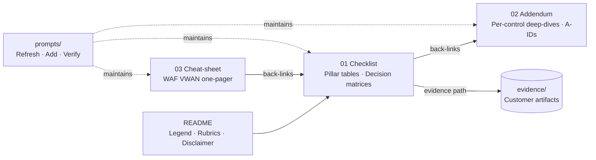

<!-- markdownlint-disable MD033 MD041 -->

<div align="center">

# 🛰️ Azure Virtual WAN Review Pack

**A customer-architect review checklist for Azure Virtual WAN —
WAF + CAF + Palo Alto Cloud NGFW + routing decision matrix.**

[](LICENSE)
[](https://squidfunk.github.io/mkdocs-material/)
[](https://github.com/jonathan-vella/azure-vwan-review/actions/workflows/docs.yml)
[](https://jonathan-vella.github.io/azure-vwan-review/)

</div>

---

## ⚡ TL;DR

> Walk the [checklist](01-vwan-review-checklist.md) pillar by pillar.
> For depth, follow the `→ A-{ID}` link into the
> [addendum](02-vwan-review-addendum.md). Use the
> [cheat-sheet](03-vwan-waf-cheatsheet.md) as a one-page WAF refresher.
> Drop evidence under `evidence/`. Track gaps in the
> [Findings backlog](01-vwan-review-checklist.md#findings-and-remediation-backlog).

## ⚠️ Disclaimer

> **AI-generated content with human review.** This pack was generated with
> AI assistance and reviewed by a human. It may contain inaccuracies,
> omissions, outdated references, or errors — including in cited Microsoft
> Learn URLs, Azure Resource Graph / `az` CLI snippets, Palo Alto Networks
> Cloud NGFW behaviour, and Virtual WAN service limits. Always validate
> against current Microsoft and Palo Alto Networks documentation before
> acting on any control. Provided **as-is, without warranty of any kind**.
> The author and the author's employer accept **no responsibility or
> liability** for any decisions, deployments, costs, outages, or security
> incidents arising from use of this material. **Use at your own risk.**

## 📊 At a glance

| Area                              | What you get                                                               |
| --------------------------------- | -------------------------------------------------------------------------- |
| 🛡️ **WAF pillars**                | Reliability · Security · Cost · Operational Excellence · Performance       |
| 🏗️ **CAF alignment**              | Landing-zone connectivity-subscription model + topology checks             |
| 🔥 **Palo Alto Cloud NGFW**       | Decision matrix vs Azure Firewall + Cloud-NGFW-specific controls           |
| 🧭 **Routing**                    | 10-row decision matrix incl. routing-intent one-way-door warning           |
| 📐 **Evidence model**             | Per-control evidence folders + status / priority / risk rubrics            |
| 📋 **Maintenance**                | Prompt-driven refresh, add / update, verify gates (see `prompts/`)         |
| 🌐 **Docs site**                  | MkDocs Material + GitHub Pages deploy on every push to `main`              |

## 🗺️ Pack structure



## 🧭 How to use this pack

<table>
<tr>
<td width="33%" valign="top">

### 1️⃣ Walk the checklist

Open [`01-vwan-review-checklist.md`](01-vwan-review-checklist.md) and set
**Status** (`Pass / Partial / Gap / N/A`) for each control row.

Capture evidence under `evidence/{ID}/`.

</td>
<td width="33%" valign="top">

### 2️⃣ Follow the back-links

For a full ARG query / `az` command / Portal procedure, follow the
`→ A-{ID}` link into
[`02-vwan-review-addendum.md`](02-vwan-review-addendum.md).

</td>
<td width="33%" valign="top">

### 3️⃣ Roll up findings

Add each gap to the
[Findings backlog](01-vwan-review-checklist.md#findings-and-remediation-backlog).

Use [`03-vwan-waf-cheatsheet.md`](03-vwan-waf-cheatsheet.md) for
stakeholder readouts.

</td>
</tr>
</table>

## 📚 Index

| File                                                                      | What's inside                                                                                          |
| ------------------------------------------------------------------------- | ------------------------------------------------------------------------------------------------------ |
| 📋 [`01-vwan-review-checklist.md`](01-vwan-review-checklist.md)            | Pillar checklists, CAF topology, Cloud NGFW section, routing matrix, findings backlog.                 |
| 🔍 [`02-vwan-review-addendum.md`](02-vwan-review-addendum.md)             | Per-control deep-dive: Learn citation, rationale, common misconfigs, full check (ARG / `az` / Portal). |
| 🎯 [`03-vwan-waf-cheatsheet.md`](03-vwan-waf-cheatsheet.md)               | WAF VWAN service guide compressed by pillar, back-linked to checklist IDs (no new controls).           |
| 🛠️ [`prompts/`](prompts/README.md)                                        | Maintenance prompts — refresh sources, add or update a control, verify the pack.                       |
| 🗂️ `evidence/`                                                            | Customer artifact dropbox. One sub-folder per Finding-ID.                                              |

## 🟢🟡🔴 Rubrics

### Status legend

| Status         | Meaning                                                                                              |
| -------------- | ---------------------------------------------------------------------------------------------------- |
| 🟢 **Pass**    | Control implemented; evidence collected.                                                             |
| 🟡 **Partial** | Control partially implemented; documented exception or in-progress remediation.                      |
| 🔴 **Gap**     | Control not implemented; remediation required.                                                       |
| ⚪ **N/A**     | Control does not apply (e.g. ExpressRoute controls when only VPN is in use). Justify in evidence.    |

### Risk rubric

_What happens if this control is missing — independent of mandatoriness._

| Risk  | Definition                                                                                                                    |
| ----- | ----------------------------------------------------------------------------------------------------------------------------- |
| **H** | Data exposure, single-region outage path, hard-to-reverse design lock-in (e.g. routing intent), unrecoverable secret leakage. |
| **M** | Degraded resilience, predictable cost overrun, partial visibility loss, manual workaround required for routine ops.           |
| **L** | Hygiene, tagging, documentation, naming, non-critical monitoring gaps.                                                        |

### Priority rubric

_How mandatory the control is for this customer's stated requirements._

| Priority        | Definition                                                                                                 |
| --------------- | ---------------------------------------------------------------------------------------------------------- |
| **Required**    | Must comply. Failure blocks production sign-off (security baseline, compliance, multi-region SLA targets). |
| **Recommended** | Should comply. Industry best practice; exceptions must be documented.                                      |
| **Optional**    | Nice-to-have or context-dependent (e.g. P2S VPN if no remote users).                                       |

> Priority and Risk are **independent**. A Recommended control can still
> be High risk if missing — always report both.

## 📁 Evidence convention

- Path: `evidence/{ID}/{short-name}.{ext}` — e.g. `evidence/SEC-03/p2s-aad-config.json`.
- Prefer raw `az ... -o json` exports over screenshots.
- Reference the file from the checklist `Evidence (path)` column relative
  to this repository root.

## 🏷️ Reality tags in the addendum

Some controls have no Azure Resource Graph coverage today. Those
addendum entries are tagged **"ARG: not available — use `az` CLI /
REST / Portal"** so reviewers do not waste time hunting for queries
that do not exist.

## 🖼️ Reference diagram

The checklist embeds a **logical Mermaid view** of a Secured VWAN hub
with Cloud NGFW. It is explicitly labeled "logical view — not a topology
diagram"; it omits address spaces, AZ placement, and physical paths
intentionally.

## 📑 Source authority

Every `→ A-{ID}` entry cites a specific Microsoft Learn page section.
The four anchor pages:

1. **WAF VWAN service guide** —
   <https://learn.microsoft.com/en-us/azure/well-architected/service-guides/azure-virtual-wan>
2. **CAF VWAN landing-zone topology** —
   <https://learn.microsoft.com/en-us/azure/cloud-adoption-framework/ready/azure-best-practices/virtual-wan-network-topology>
3. **Secure Virtual WAN** —
   <https://learn.microsoft.com/en-us/azure/virtual-wan/secure-virtual-wan>
4. **Configure Palo Alto Networks Cloud NGFW in Virtual WAN** —
   <https://learn.microsoft.com/en-us/azure/virtual-wan/how-to-palo-alto-cloud-ngfw>

First-hop sub-pages enumerated during source harvesting (in-scope where
cited): About virtual hub routing, How to configure routing intent and
routing policies, About NVA in a VWAN hub, Disaster recovery design for
VWAN, VWAN limits, Encryption in transit (VPN over ExpressRoute),
Migrate to Azure Virtual WAN, Hub-virtual-network vs secured-virtual-hub
comparison, Palo Alto Networks Cloud NGFW for Azure deployment
architectures.

## 📤 Conversion to Word / Excel

All tables are pure Markdown — **no code fences inside cells** — so they
paste cleanly into Word and Excel without row inflation. Multi-line
commands and long ARG queries live in the addendum entries, not in
the checklist cells.

## 🎯 Scope and exclusions

- **In scope**: VWAN Standard hub, VPN / ExpressRoute / P2S gateways,
  secured virtual hub with Azure Firewall or Cloud NGFW, routing intent
  and policies, custom route tables, CAF connectivity-subscription
  placement.
- **Out of scope**: Palo Alto VM-Series NVA in the VWAN hub (Cloud NGFW
  SaaS only); SD-WAN partner appliances in the hub (covered only at the
  CAF-topology level); on-premises device hardening.

## 🌐 Local dev (MkDocs Material)

Browse the pack locally exactly as published on GitHub Pages:

```bash
python -m venv .venv
source .venv/bin/activate
pip install -r requirements.txt
mkdocs serve
# open http://localhost:8000
```

Verify before commit (same gates CI enforces):

```bash
node scripts/verify.mjs           # anchor resolution
npx markdownlint-cli2 '*.md'      # markdown style
mkdocs build --strict             # site build + internal-link check
```

## 🛠️ Keeping the pack current

The [`prompts/`](prompts/README.md) folder contains LLM-friendly
maintenance recipes:

| Prompt                                                                       | Cadence                                                |
| ---------------------------------------------------------------------------- | ------------------------------------------------------ |
| [`00-blueprint.prompt.md`](prompts/00-blueprint.prompt.md)                   | Read first — explains how this pack was built.         |
| [`refresh-sources.prompt.md`](prompts/refresh-sources.prompt.md)             | Quarterly — re-validate Microsoft Learn citations.     |
| [`add-or-update-control.prompt.md`](prompts/add-or-update-control.prompt.md) | Per change — controlled mutation across all 3 files.   |
| [`verify-pack.prompt.md`](prompts/verify-pack.prompt.md)                     | Every commit — anchor + lint + MkDocs strict gate.     |

## 📄 License

[MIT](https://github.com/jonathan-vella/azure-vwan-review/blob/main/LICENSE) — see the disclaimer above.
AI-generated content reviewed by a human; no warranty, no liability.
